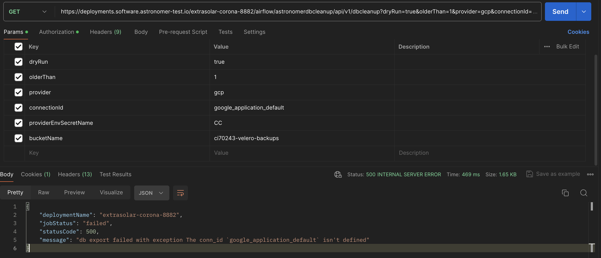
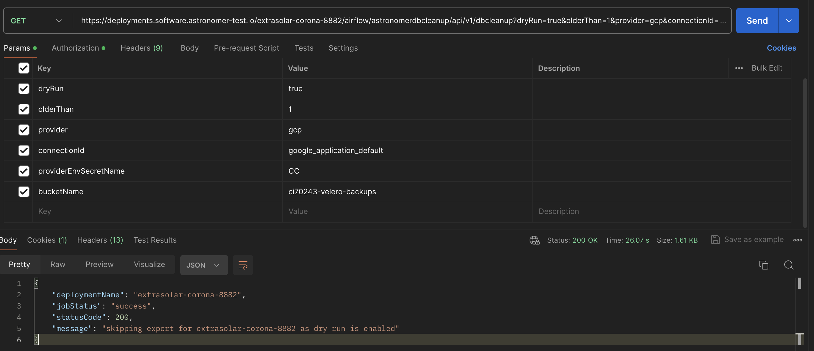
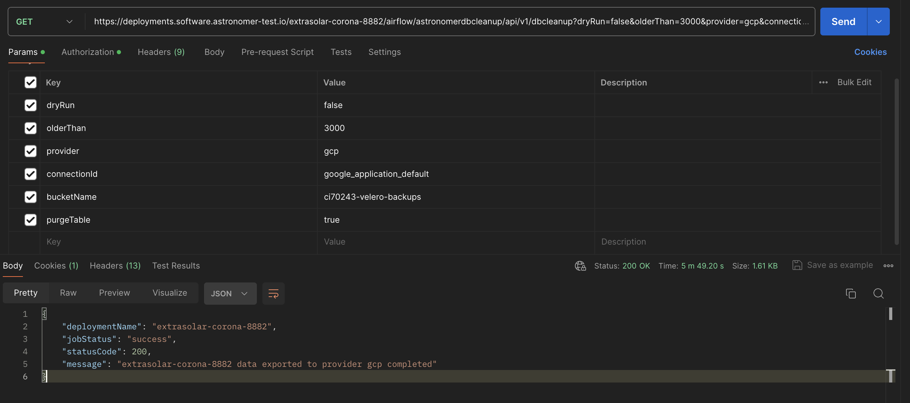

Airflow Rest Based cleanup plugin to cleanup and archieve metadata table

# Plugin Supports below set of arguments


| Argument      | Description |
| ----------- | ----------- |
| olderThan      | param to define the number of days to run cleanup before the specified day       |
| dryRun   | param to  to see the impacted tables before running actual run. Default True        |
| exportFormat   | param to export the data to specified format. Supports only CSV at the moment. Default: csv        |
| outputPath   | param to define the path where the data to export temperovarily before exporting to actual path. Default: /tmp        |
| provider   | Define the cloud provider to export the archieved data. Supported providers are gcp, aws, azure, local. Default: local        |
| connectionId   | param to define pre-created airflow conn_id available in airflow deployments. Default is None        |
| providerEnvSecretName   | param to alternatively pass secret as env vars         |
| bucketName   | param to pass cloud storage bucket name         |
| purgeTable   | param to cleanup tables, exported data in tmp location after archival. Default False        |
| deploymentName   | param to pass custom deployment name        |


# AWS cloud configuration


# Basic aws usage

## using airflow conn id method to run airflow db cleanup


##

provider: ```gcp``` allows to connect gcp cloud provider to export the task data

dryRun ```true``` run and displays the data in airflow data to be cleaned info in the logs without executing the actual export

olderThan ```1``` how many days of old data to be cleaned up

connectionId: ```default:google_application_default``` if no connection id is defined it takes the default if specified it looks for the connection and tried to connect the provided one








