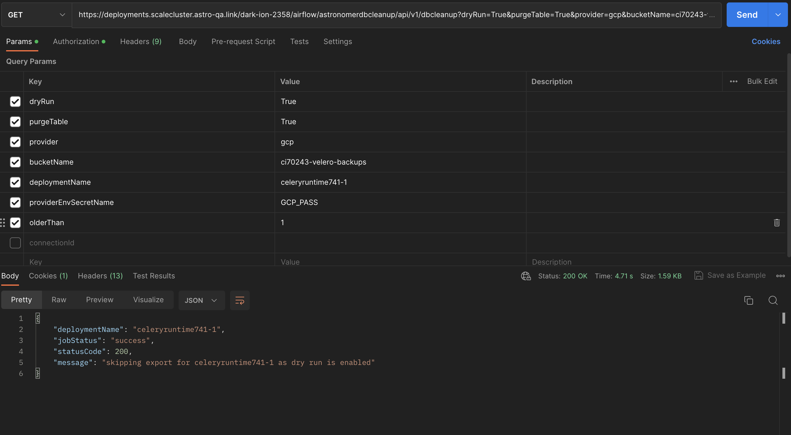

Airflow Rest Based cleanup plugin to cleanup and archieve metadata table 

Supported Arguments

| Argument      | Description |
| ----------- | ----------- |
| olderThan      | param to define the number of days to run cleanup before the specified day       |
| dryRun   | param to  to see the impacted tables before running actual run. Default True        |
| exportFormat   | param to export the data to specified format. Supports only CSV at the moment. Default: csv        |
| outputPath   | param to define the path where the data to export temperovarily before exporting to actual path. Default: /tmp        |
| provider   | Define the cloud provider to export the archieved data. Supported providers are gcp, aws, azure, local. Default: local        |
| connectionId   | param to define pre-created airflow conn_id available in airflow deployments. Default is None        |
| providerEnvSecretName   | param to alternatively pass secret as env vars         |
| bucketName   | param to pass cloud storage bucket name         |
| purgeTable   | param to cleanup tables, exported data in tmp location after archival. Default False        |
| deploymentName   | param to pass custom deployment name        |

How to use the plugin 

Step 1 : Install the plugin with latest version  

Step 2 : Plugin usage with  dryRun set to true

https://deployments.<base-domain>/<releasename>/airflow/astronomerdbcleanup/api/v1/dbcleanup

